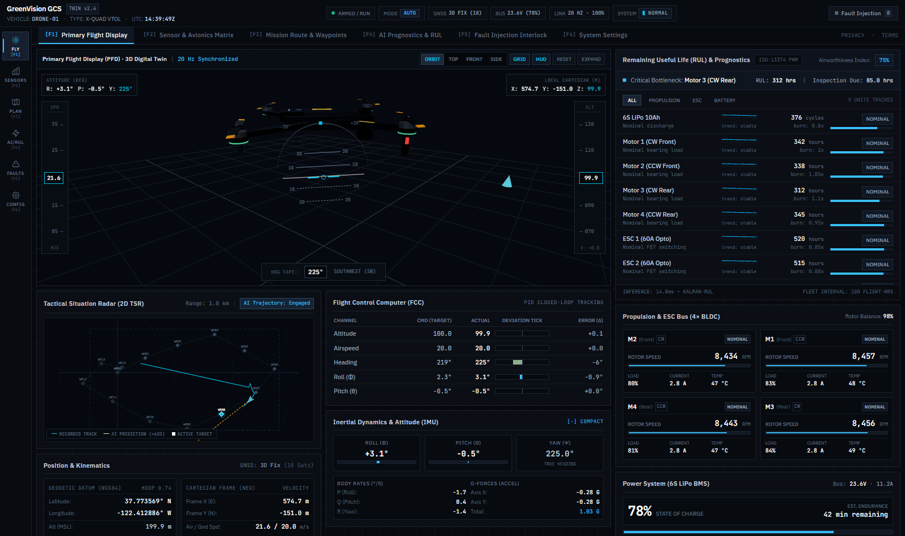
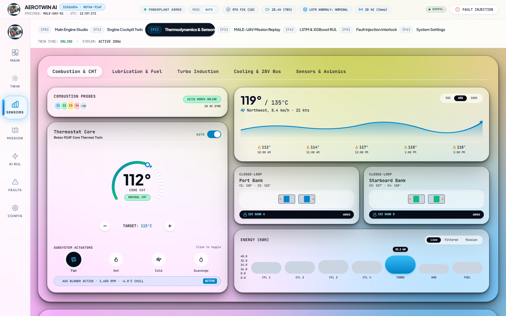
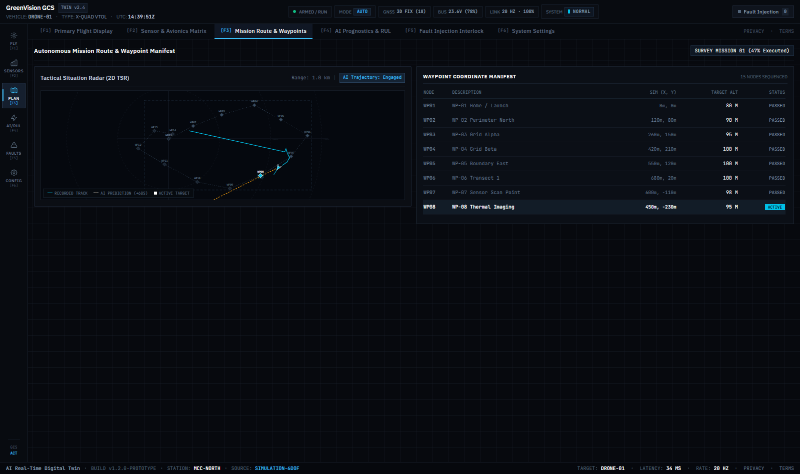
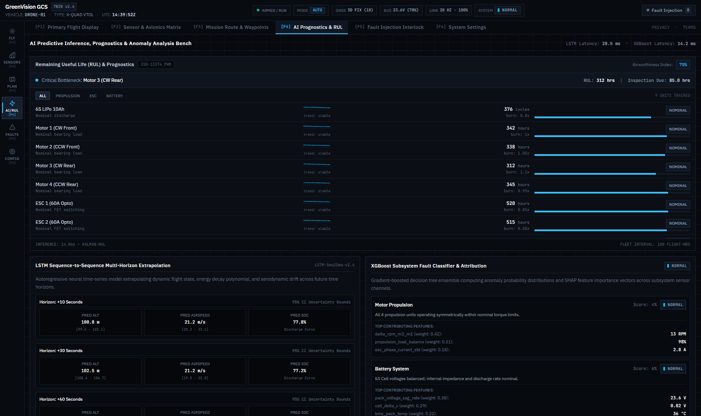
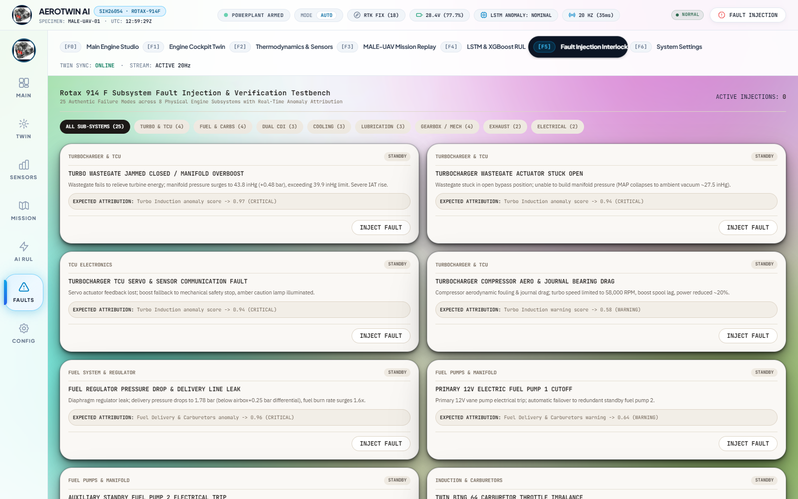
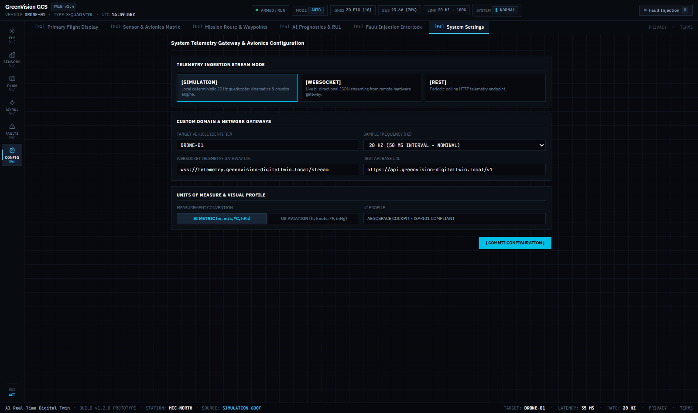
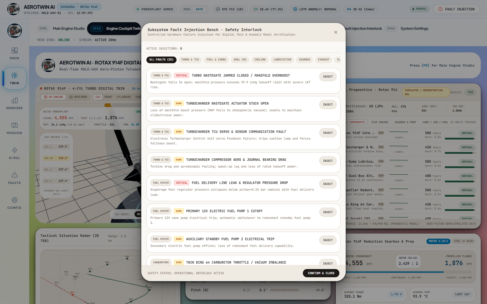
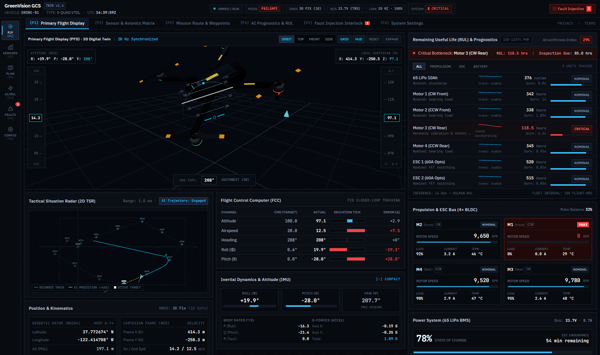

<div align="center">

# ✈️ AEROTWIN AI

### Real-Time Digital Twin for MALE-UAV Aero-Piston Engine

**Smart India Hackathon 2026 · Problem Statement SIH26054**

[](https://react.dev)
[](https://threejs.org)
[](https://vitejs.dev)
[](https://www.typescriptlang.org)
[](https://nextjs.org)
[](https://python.org)
[](LICENSE)

---

*A software-based AI-enabled real-time Digital Twin system for monitoring, simulation, anomaly/fault prediction, degradation analysis, RUL estimation, mission simulation/replay, and environmental scenario analysis for a Rotax 914F aero-piston engine powering a Medium-Altitude Long-Endurance UAV.*

</div>

---

## 📋 Table of Contents

- [Overview](#-overview)
- [Key Features](#-key-features)
- [System Architecture](#-system-architecture)
- [Tech Stack](#-tech-stack)
- [Dashboard Screenshots](#-dashboard-screenshots)
- [Project Structure](#-project-structure)
- [Getting Started](#-getting-started)
- [Engine Telemetry Parameters](#-engine-telemetry-parameters)
- [AI / ML Models](#-ai--ml-models)
- [Simulation Scenarios](#-simulation-scenarios)
- [Team](#-team)
- [License](#-license)

---

## 🔍 Overview

**AeroTwin AI** is a continuously updated virtual representation of a physical aero-piston engine. The digital twin receives telemetry data representing the operating condition of the engine and feeds it through AI analysis pipelines to provide real-time anomaly detection, fault prediction, degradation monitoring, and remaining useful life (RUL) estimation.

```
Engine / Simulation
  → Telemetry Stream
  → Digital Twin (State Synchronization)
  → Historical State Database
  → AI Analysis (LSTM Autoencoder + XGBoost)
  → Anomaly / Fault Detection
  → Degradation Analysis
  → RUL Prediction
  → Mission & Maintenance Insight
```

> The Digital Twin is not merely a static 3D model — its state corresponds to changing telemetry and operating conditions in real time. The AI layer is an analytical component of the Digital Twin rather than its entire identity.

---

## ✨ Key Features

| Feature | Description |
|---|---|
| **Real-Time Engine Monitoring** | Live telemetry visualization of RPM, CHT, EGT, oil pressure/temperature, fuel flow, vibration, and electrical systems |
| **3D Digital Twin** | Interactive Three.js-powered 3D MALE-UAV model with real-time state synchronization and procedural animation |
| **Anomaly Detection** | LSTM Autoencoder for detecting unusual temporal behavior in engine parameters |
| **Fault Prediction** | XGBoost-based supervised fault classification across 8+ failure modes |
| **Degradation Tracking** | Component-level degradation monitoring with trend analysis |
| **RUL Estimation** | Remaining Useful Life prediction for engine components and subsystems |
| **Mission Simulation** | Simulated UAV mission profiles with engine response modeling |
| **Mission Replay** | Timeline scrubber to replay past missions, anomalies, and degradation events |
| **Environmental Simulation** | Engine behavior modeling under varying altitude, temperature, humidity, and wind conditions |
| **Fault Injection Testbench** | Controlled fault injection for AI model benchmarking and validation |
| **Flight Path Mapping** | 2D mission route visualization with waypoint tracking |
| **Engineering HMI Dashboard** | High-density, professional Ground Control Station interface |

---

## 🏗 System Architecture

```
┌─────────────────────────────────────────────────────────────────────┐
│                    TELEMETRY SOURCE LAYER                          │
│  ┌─────────────────────┐    ┌──────────────────────────────────┐   │
│  │  6-DOF Physics Sim  │    │  Hardware Telemetry Stream (OBD) │   │
│  └──────────┬──────────┘    └───────────────┬──────────────────┘   │
│             └───────────────┬───────────────┘                      │
└─────────────────────────────┼──────────────────────────────────────┘
                              ▼
┌─────────────────────────────────────────────────────────────────────┐
│                    DIGITAL TWIN CORE                               │
│  ┌──────────────┐  ┌────────────────┐  ┌────────────────────────┐  │
│  │ State Engine  │  │ Telemetry DB   │  │ Simulation Dynamics    │  │
│  │ (Real-Time    │  │ (Historical    │  │ (Throttle → Fuel →     │  │
│  │  Sync)        │  │  State)        │  │  Combustion → Torque)  │  │
│  └──────┬───────┘  └───────┬────────┘  └───────────┬────────────┘  │
│         └──────────────────┼───────────────────────┘               │
└────────────────────────────┼───────────────────────────────────────┘
                             ▼
┌─────────────────────────────────────────────────────────────────────┐
│                     AI ANALYSIS LAYER                              │
│  ┌──────────────────────┐      ┌──────────────────────────────┐    │
│  │  LSTM Autoencoder    │      │  XGBoost Classifier          │    │
│  │  ─ Anomaly Detection │      │  ─ Fault Classification      │    │
│  │  ─ Temporal Patterns │      │  ─ Degradation Tracking      │    │
│  │  ─ Reconstruction    │      │  ─ RUL Estimation            │    │
│  │    Error Scoring     │      │  ─ Feature Engineering       │    │
│  └──────────┬───────────┘      └──────────────┬───────────────┘    │
│             └───────────────┬─────────────────┘                    │
└─────────────────────────────┼──────────────────────────────────────┘
                              ▼
┌─────────────────────────────────────────────────────────────────────┐
│                   VISUALIZATION & HMI LAYER                       │
│  ┌──────────────┐  ┌──────────────┐  ┌──────────────────────────┐  │
│  │ 3D Twin View │  │ Telemetry    │  │ GCS Dashboard            │  │
│  │ (Three.js /  │  │ Charts &     │  │ (Navigation Rail,        │  │
│  │  R3F)        │  │ Gauges       │  │  Alerts, Mission Map)    │  │
│  └──────────────┘  └──────────────┘  └──────────────────────────┘  │
└─────────────────────────────────────────────────────────────────────┘
```

---

## 🛠 Tech Stack

### Frontend (Dashboard & 3D Twin)
| Technology | Purpose |
|---|---|
| **React 18** + **TypeScript** | UI framework & type safety |
| **Three.js** / **React Three Fiber** | 3D Digital Twin rendering |
| **@react-three/drei** | 3D utilities, controls, and helpers |
| **@react-three/postprocessing** | Visual effects (bloom, SSAO) |
| **Framer Motion** | UI animations & page transitions |
| **GSAP** | Advanced animation sequencing |
| **Vite** | Dev server & build tooling |
| **Tailwind CSS** | Utility-first styling |
| **Lucide React** | Iconography |

### Backend / ML Pipeline
| Technology | Purpose |
|---|---|
| **Python** | ML training & inference |
| **LSTM Autoencoder** | Time-series anomaly detection |
| **XGBoost** | Fault classification & RUL estimation |
| **PyTorch / TensorFlow** | Deep learning framework |

### Secondary App (Next.js)
| Technology | Purpose |
|---|---|
| **Next.js 16** | Server-rendered companion app |
| **Tailwind CSS v4** | Styling |

---

## 📸 Dashboard Screenshots

<div align="center">

| Primary Dashboard | Sensor Matrix |
|---|---|
|  |  |

| Mission Route | AI Predictions |
|---|---|
|  |  |

| Fault Testbench | System Settings |
|---|---|
|  |  |

| Fault Injection Modal | Fault-Injected Dashboard |
|---|---|
|  |  |

</div>

---

## 📁 Project Structure

```
SIH-Real-Time-Digital-Twin-of-Aero-Piston-Engine/
│
├── frontend/                      # Primary dashboard (Vite + React + Three.js)
│   ├── src/
│   │   ├── App.tsx                # Root application with page routing
│   │   ├── components/
│   │   │   ├── 3d/                # 3D scene utilities
│   │   │   ├── dashboard/         # Dashboard cards & widgets
│   │   │   │   ├── Header.tsx              # Operations flight bar
│   │   │   │   ├── PropulsionCard.tsx      # Engine propulsion telemetry
│   │   │   │   ├── TelemetryCharts.tsx     # Real-time telemetry charts
│   │   │   │   ├── RemainingUsefulLifeCard.tsx  # RUL prediction display
│   │   │   │   ├── AIPredictionCard.tsx    # AI model outputs
│   │   │   │   ├── FaultInjectionModal.tsx # Fault injection interface
│   │   │   │   ├── FlightPathMap.tsx       # 2D mission route map
│   │   │   │   ├── AlertEventLog.tsx       # Alert & event timeline
│   │   │   │   ├── SimulationControls.tsx  # Sim playback controls
│   │   │   │   └── ...                     # Environment, Battery, Mission cards
│   │   │   ├── digital-twin/      # 3D Digital Twin components
│   │   │   │   ├── DigitalTwinView.tsx     # Main 3D viewport
│   │   │   │   └── DroneModel3D.tsx        # Procedural MALE-UAV 3D model
│   │   │   ├── pages/             # Full-page views
│   │   │   │   ├── BentoShowcaseView.tsx   # Overview bento grid
│   │   │   │   ├── MainDashboard.tsx       # Primary ops dashboard
│   │   │   │   ├── DetailedTelemetry.tsx   # Deep telemetry analysis
│   │   │   │   ├── AIAnalysis.tsx          # AI predictions page
│   │   │   │   ├── FaultTestbench.tsx      # Fault injection testing
│   │   │   │   ├── MissionPlanner.tsx      # Mission route planning
│   │   │   │   └── SystemSettings.tsx      # Configuration panel
│   │   │   └── ui/                # Reusable UI primitives
│   │   ├── context/               # React context (TelemetryProvider)
│   │   ├── services/              # Telemetry simulation, config
│   │   └── types/                 # TypeScript type definitions
│   └── screenshots/               # Dashboard screenshots
│
├── SIH/                           # Secondary app (Next.js 16)
│   ├── app/                       # Next.js app router
│   └── components/                # Shared components
│
├── src/                           # ML / Backend source code
│   ├── data/                      # Data loading & preprocessing
│   ├── models/                    # LSTM, XGBoost model definitions
│   ├── training/                  # Training scripts & pipelines
│   ├── evaluation/                # Model evaluation & metrics
│   └── tools/                     # Utility & inspection tools
│
├── configs/                       # Configuration files (YAML)
├── data/                          # Datasets (raw, processed, sample)
├── docs/                          # Project documentation
│   ├── ARCHITECTURE.md            # System architecture specification
│   ├── DATA_REQUIREMENTS.md       # Dataset requirements
│   ├── PROJECT_SPECIFICATION.md   # Full project spec
│   ├── EVALUATION_STANDARDS.md    # Model evaluation criteria
│   └── TASKS.md                   # Task tracking
├── experiments/                   # Experiment metadata & outputs
├── scripts/                       # Utility scripts
├── start.sh                       # One-click launcher (Linux/macOS)
├── start.bat                      # One-click launcher (Windows)
└── PROJECT_CONTEXT_AEROTWIN.md    # Comprehensive project context
```

---

## 🚀 Getting Started

### Prerequisites

- **Node.js** ≥ 18.x — [Download](https://nodejs.org/)
- **npm** ≥ 9.x (bundled with Node.js)
- **Python** ≥ 3.10 (for ML pipeline)
- **Git** — [Download](https://git-scm.com/)

### Quick Start

**1. Clone the repository**
```bash
git clone https://github.com/manas2k06/SIH-Real-Time-Digital-Twin-of-Aero-Piston-Engine.git
cd SIH-Real-Time-Digital-Twin-of-Aero-Piston-Engine
```

**2. One-click launch (recommended)**

*Windows:*
```cmd
start.bat
```

*Linux / macOS:*
```bash
chmod +x start.sh
./start.sh
```

This will automatically install dependencies (if needed) and launch the development server.

**3. Manual launch**
```bash
cd frontend
npm install
npm run dev
```

The dashboard will be available at **http://localhost:3000/**

### Secondary App (Next.js)
```bash
cd SIH
npm install
npm run dev
```

---

## 📊 Engine Telemetry Parameters

The digital twin monitors the following engine parameters in real time:

| Parameter | Unit | Purpose |
|---|---|---|
| **RPM** | rev/min | Engine rotational speed |
| **Cylinder Head Temperature (CHT)** | °C | Overheating, abnormal combustion, thermal stress detection |
| **Exhaust Gas Temperature (EGT)** | °C | Abnormal combustion, mixture changes, thermal anomalies |
| **Oil Pressure** | bar / PSI | Lubrication system pressure monitoring |
| **Oil Temperature** | °C | Lubrication thermal state, overheating, degradation |
| **Fuel Flow** | L/h | Fuel consumption rate, leak detection, load analysis |
| **Vibration** | g (RMS) | Mechanical abnormality: unbalance, bearing faults, wear |
| **Battery / Electrical** | V / A | Voltage, current, alternator output, electrical load |
| **Injection Timing** | ms / °CA | Fuel injection timing deviation detection |
| **Throttle Position** | % | Pilot input & engine load reference |

### Additional Operating Parameters
- Torque, Power Output, Operating Hours, Cycle Count
- Flight Phase, Altitude, Ambient Temperature, Atmospheric Pressure
- Humidity, Wind Speed & Direction, Air Density

---

## 🤖 AI / ML Models

### Model 1: LSTM Autoencoder — Anomaly Detection

```
Historical Telemetry Sequence
  → LSTM Encoder
  → Latent Temporal Representation
  → LSTM Decoder
  → Reconstructed Sequence
  → Reconstruction Error
  → Anomaly Score
```

Detects anomalous temporal behaviors, non-linear correlations, and temporal pattern deviations in engine telemetry streams.

### Model 2: XGBoost — Fault Classification & RUL

Operates on structured/tabular telemetry with engineered features:
- **Inputs**: Aggregated telemetry, rolling statistics, delta features, environmental parameters, cycle counts
- **Outputs**: Fault classification, degradation score, RUL estimate

### Predictive Maintenance Pipeline

```
Telemetry → Health Monitoring → Anomaly Detection (LSTM) → Degradation Assessment → RUL Estimation (XGBoost) → Maintenance Advisory
```

---

## 🧪 Simulation Scenarios

| Scenario | Description |
|---|---|
| **Normal Operation** | Baseline healthy engine envelope for reference |
| **High Altitude** | Reduced atmospheric pressure / air density effects |
| **Hot Weather** | Elevated ambient temperature, thermal cooling stress |
| **Endurance Operation** | Prolonged running for degradation & RUL analysis |
| **Rapid Throttle Changes** | Transient response and engine surge testing |
| **Fault Injection** | Controlled abnormal states for AI model benchmarking |

### Supported Fault/Failure Modes
- 🔥 **Engine Overheating** — Abnormal CHT / EGT / Oil Temp rise
- 🛢️ **Oil Pressure Abnormality** — Low lubrication pressure, pump failure
- 📳 **Excessive Vibration** — Mechanical wear, bearing faults, unbalance
- ⚡ **RPM Abnormality** — Hunting, drop under load, surge
- ⛽ **Fuel System Fault** — Injector clogging, abnormal flow, leak
- ⏱️ **Injection Timing Fault** — Advance/retard deviation
- 🔌 **Electrical Fault** — Low voltage, over-current, alternator failure
- 📡 **Sensor Fault** — Drift, noise, stuck value, dropout

---

## 👥 Team

Built for **Smart India Hackathon 2026** — Problem Statement **SIH26054**

---

## 📄 License

This project is licensed under the [MIT License](LICENSE).

---

<div align="center">

**Built with 🛩️ for SIH 2026**

*AeroTwin AI — Where Digital Meets Physical*

</div>
